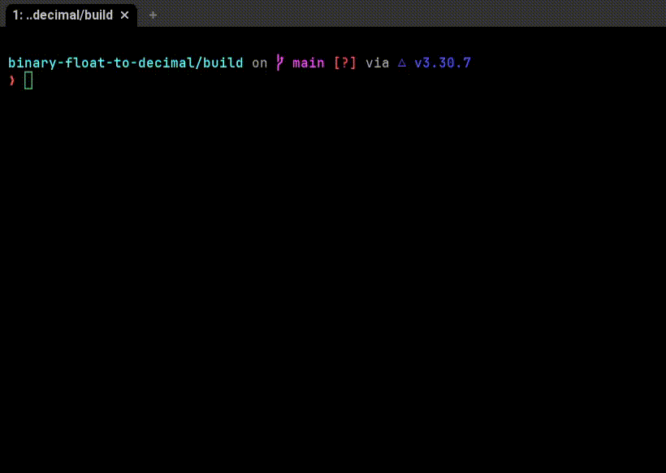

# BinaryFloatToDecimal

C program that converts a 32-bit binary representation of a single-precision floating-point number (IEEE 754 standard) into its decimal equivalent.  It takes a binary string as input and outputs the corresponding decimal float value.



## Getting Started

### Prerequisites

Ensure you have the following tools installed:

- [C Compiler](https://gcc.gnu.org/) (GCC is recommended)
- [CMake](https://cmake.org/) (version 3.10 or higher)
- [Make](https://www.gnu.org/software/make/) (or a compatible build tool, usually comes with development environments)
- [Doxygen](http://www.doxygen.nl/index.html) (Optional, for generating documentation)

### Installing

Follow these steps to get the BinaryFloatToDecimal program up and running:

1.  **Clone the repository** to your local machine using Git:

    ```bash
    git clone https://github.com/araujoviana/binary-float-to-decimal
    cd binary-float-to-decimal
    ```

2.  **Create a build directory** and navigate into it:

    ```bash
    mkdir build
    cd build
    ```

3.  **Configure the project with CMake**:

    ```bash
    cmake ..
    ```

4.  **Compile the program**:

    ```bash
    make
    ```

After these steps, the executable `BinaryFloatToDecimal` will be created in the `build` directory.

### Running the Program

To run the program, simply execute the compiled binary from the `build` directory:

```bash
./BinaryFloatToDecimal
```

The program will then prompt you to enter a 32-bit binary floating-point number. Enter the binary string and press Enter to see its decimal equivalent.

## Built With

This project was built using the following tools:

- [C](https://en.wikipedia.org/wiki/C_(programming_language)) - The programming language
- [CMake](https://cmake.org/) - Cross-platform build system
- [Doxygen](http://www.doxygen.nl/index.html) - Documentation generator


## License

This project is licensed under the MIT License - see the LICENSE.md file for details.

